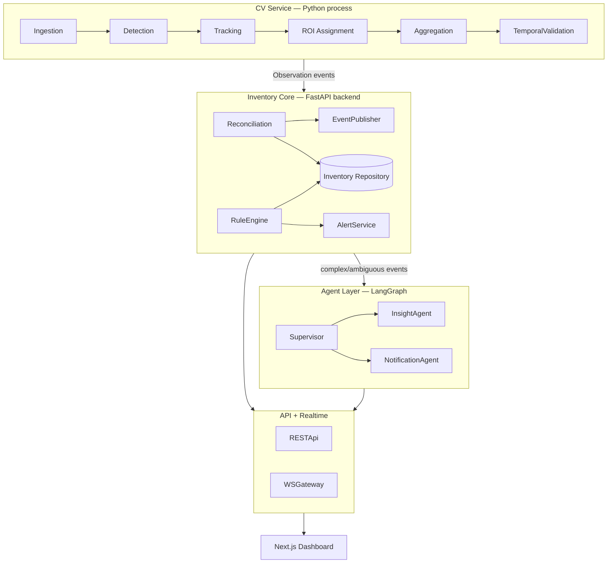
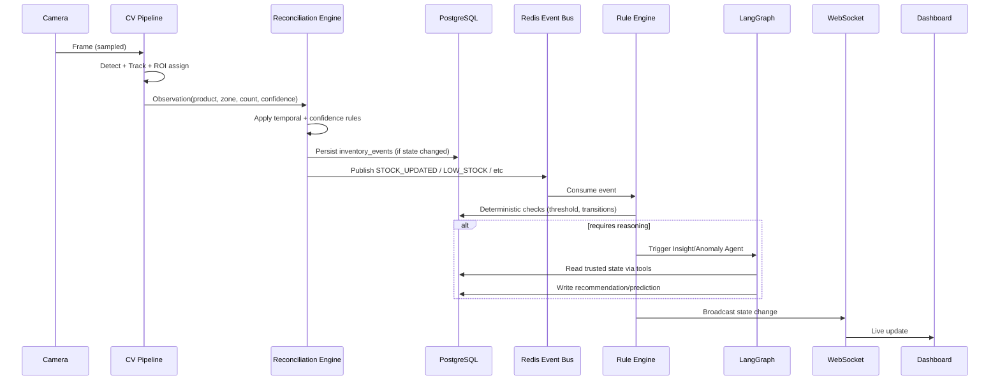
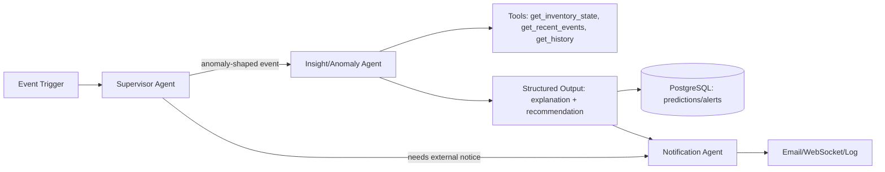
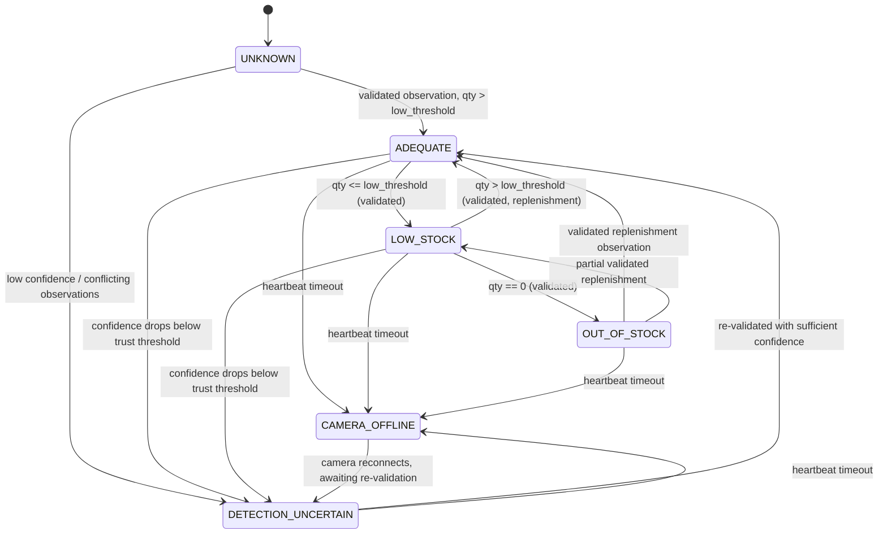

# IntelliStock Agent — Architecture Review & Master Plan (v1)

Acting as Senior Architect / Tech Lead / FYP Advisor. This document is the first deliverable requested: audit + final architecture + backlog + Phase 1 plan. No implementation code yet.

---

## 1. Executive Architecture Review

The plan's core insight is correct and worth protecting: **CV output is an observation, not truth**. Most student CV/inventory projects fail academically because they treat YOLO counts as ground truth and call it "AI-powered inventory." Your document already avoids that trap conceptually — the job here is to make it *specific enough to implement and defend*, and to cut anything that adds risk without adding marks.

Overall verdict: the plan is **ambitious but directionally sound**. The biggest risk is not "wrong technology," it's **scope vs. one-person-FYP-timeline**. A camera→YOLO→tracking→reconciliation→events→rules→LangGraph→dashboard pipeline is genuinely a small team's 3-6 month product. As an FYP it's achievable **only if you ruthlessly sequence it as vertical slices and treat LangGraph/Copilot as the last 20%, not the core 80%**.

Second risk: **reconciliation logic is where the actual engineering "meat" of your grade lives** (evaluators will not be impressed by "I ran yolov8"), so it needs to be the most rigorously designed part — this document treats it that way.

Third risk: **evaluation methodology**. Many FYPs lose marks not on code but on "how do you know it works." Section 22 in your plan is good instinct; it needs concrete metric collection built in from Phase 1, not bolted on at the end.

---

## 2. What I Would Keep

- The layered mental model (CV → Inventory Engine → Rules → Agents → Dashboard → Notifications). This is your strongest architectural asset and your best FYP defense narrative — keep repeating it in your documentation and viva.
- Explicit rule: **LLMs never do deterministic math**. This alone will impress evaluators who've seen "AI" projects that just prompt-engineer everything.
- PostgreSQL as source of truth, Redis as transient/event layer only.
- Rejecting Kafka/K8s/RabbitMQ/Celery/ChromaDB by default. Correct call for FYP scope — every one of these adds ops burden with zero marks-per-hour-invested for a solo student project.
- Vertical-slice phased delivery over big-bang.
- Event-driven design for inventory changes (not polling).
- ByteTrack as tracker starting point (lightweight, no re-ID model needed initially).
- The Live Monitor + AI Copilot as the "wow factor" demo pieces — good for viva impact, correctly placed late in sequence.

## 3. What I Would Change

| # | Change | Reason |
|---|--------|--------|
| 1 | Collapse LangGraph's 6 agents down to **3 for MVP** (Supervisor, Anomaly/Insight, Notification) | 6 independently-routed agents is enterprise-scale; for FYP scope this triples testing surface for marginal grading benefit. Forecast/Alert logic can start as deterministic rules and only "graduate" to agent reasoning if time remains. |
| 2 | Introduce an explicit **`observation_window`** concept before "temporal validation" — i.e., define it as a first-class table, not just a rule | Your plan mentions temporal consistency but never gives it a data structure. Without one, reconciliation logic has nothing concrete to query. |
| 3 | Add a **Camera Health / Heartbeat service** as its own small component | Currently implied only through `CAMERA_OFFLINE` event; it needs an owner (who detects offline? timeout-based, missing-frame-based?). |
| 4 | Downgrade Qdrant/vector DB to **explicitly out of MVP**, revisit only if Copilot demo needs semantic product search | Your plan already hints at this — I'm making it a hard rule so it doesn't creep back in during Phase 11. |
| 5 | Add a lightweight **simulation/replay mode** for CV pipeline (recorded video / synthetic detections) | You will not have a live retail camera feed reliably available during dev or on defense day. This de-risks your whole demo. |
| 6 | Explicit **confidence-to-trust mapping** must be a config table, not hardcoded thresholds | Needed for FYP defensibility — "why 0.6?" needs an answer backed by a documented calibration process, not a magic number in code. |
| 7 | Make **Alert dedup / cooldown window** an explicit first-class rule, not implicit | Otherwise your demo will spam 40 alerts because a box flickers between LOW_STOCK and ADEQUATE. This is the #1 cause of embarrassing live demos in CV projects. |
| 8 | WebSocket layer should broadcast **from Redis pub/sub**, not directly from FastAPI request handlers | Keeps CV/backend decoupled from frontend connection lifecycle; avoids losing events when no client is connected. |

---

## 4. Final Recommended Architecture

### 4.1 High-Level Architecture

```mermaid
flowchart LR
    CAM[Camera / Video File] --> ING[Video Ingestion Service]
    ING --> YOLO[YOLO Detection]
    YOLO --> TRACK[ByteTrack]
    TRACK --> ROI[ROI / Shelf Assignment]
    ROI --> OBS[Observation Builder]
    OBS --> REC[Reconciliation Engine]
    REC -->|writes| PG[(PostgreSQL)]
    REC -->|publishes| REDIS[(Redis Pub/Sub + Cache)]
    REDIS --> EVT[Event Processor]
    EVT --> RULES[Rule Engine]
    RULES -->|deterministic| PG
    RULES -->|complex cases| LG[LangGraph Agents]
    LG --> PG
    RULES --> WS[WebSocket Gateway]
    LG --> WS
    PG --> API[FastAPI REST]
    WS --> FE[Next.js Dashboard]
    API --> FE
```



### 4.2 Component Architecture



### 4.3 Data Flow (single detection cycle)



### 4.4 Inventory Reconciliation Flow — see Section 5 (dedicated design)

### 4.5 Event Flow — see Section 6

### 4.6 LangGraph Workflow



### 4.7 API Architecture
FastAPI, versioned `/api/v1`, layered as `api → services → repositories → models`. Frontend never touches Postgres/Redis directly — only REST + WebSocket.

### 4.8 Database Architecture — see Section 7

### 4.9 Frontend Architecture
Next.js App Router, route groups per nav section (`(overview)`, `(monitoring)`, `(intelligence)`, `(management)`, `(system)`), shared `lib/api` client, `lib/ws` singleton hook, shadcn/ui component layer, Recharts for analytics.

### 4.10 Security Architecture
JWT (access + refresh), RBAC middleware at router-dependency level, Pydantic input validation everywhere, CORS locked to frontend origin, secrets via `.env` + Docker secrets, audit log table for state-changing actions.

### 4.11 Failure/Recovery Architecture
- CV process crash → does not affect FastAPI/DB; heartbeat marks camera `CAMERA_OFFLINE` after N missed frames.
- LangGraph agent failure → caught at Supervisor level, falls back to "no recommendation" state, logged to `agent_runs`, never blocks rule engine or inventory updates.
- Redis unavailable → CV/reconciliation still writes to Postgres (source of truth); WebSocket live updates degrade gracefully, dashboard falls back to polling.
- DB unavailable → CV pipeline buffers observations in memory briefly, then pauses ingestion (fail-safe, not fail-open, to avoid silent data loss).

---

## 5. Inventory Reconciliation Engine

### 5.1 Three Concepts, Strictly Separated

| Layer | Definition | Example |
|---|---|---|
| **Observation** | Raw, unvalidated signal from CV for one detection cycle | "Camera 3, Zone B, Product 17: saw 4 units, confidence 0.71, at 14:02:03" |
| **Inventory State** | Reconciled, trusted estimate after applying confidence/temporal/tracking rules | "Product 17 in Zone B: quantity_estimate=4, status=ADEQUATE, last_validated=14:02:03" |
| **Business State** | Rule-engine interpretation of inventory state against business thresholds/policy | "Product 17 is below reorder threshold → LOW_STOCK alert eligible" |

Observations are cheap and noisy (many per minute). Inventory State updates only when reconciliation logic accepts a change. Business State only changes in response to Inventory State changes, never directly from Observations.

### 5.2 `observation_window` (new component vs. original plan)

A rolling window per (camera, zone, product) that stores the last **N observations** (config, default N=5) or last **T seconds** (default 10s). Reconciliation only commits a state change when:
1. Majority (or weighted-confidence) agreement across the window, **and**
2. The change persists across ≥2 consecutive sampled frames (anti-flicker), **and**
3. Confidence ≥ configured trust threshold for that camera/product pair.

This window can live in Redis (cheap, short-lived) with periodic snapshot to Postgres only on committed state changes — keeps Postgres write volume sane (Rule 20: no per-frame writes).

### 5.3 State Machine



**Transition conditions (exact):**
- `ADEQUATE → LOW_STOCK`: reconciled quantity ≤ `product.low_stock_threshold`, confirmed across observation window.
- `LOW_STOCK → OUT_OF_STOCK`: reconciled quantity == 0, confirmed across window (higher confirmation count than other transitions — false OUT_OF_STOCK is the most damaging false alert).
- `OUT_OF_STOCK → ADEQUATE/LOW_STOCK`: requires a **replenishment-shaped observation** (quantity increased across ≥2 windows, not a single noisy frame) — prevents a single misdetection from "restocking" a shelf that's actually still empty.
- `* → DETECTION_UNCERTAIN`: confidence below trust threshold, OR conflicting counts within window exceed variance tolerance.
- `* → CAMERA_OFFLINE`: no frames/heartbeat received for `camera.offline_timeout_seconds` (default 30s).
- Invalid/unlisted transitions are rejected at the repository layer (enforced via a transition-table lookup, not scattered if/else).

---

## 6. Event Model

All events are Pydantic models, published to Redis pub/sub channel `inventory.events`, and selectively persisted.

```python
class BaseInventoryEvent(BaseModel):
    event_id: UUID
    event_type: Literal[
        "DETECTION_OBSERVED", "STOCK_UPDATED", "LOW_STOCK", "OUT_OF_STOCK",
        "STOCK_REPLENISHED", "ANOMALY_DETECTED", "CAMERA_ONLINE",
        "CAMERA_OFFLINE", "PREDICTION_CREATED", "ALERT_CREATED", "ALERT_RESOLVED"
    ]
    timestamp: datetime
    camera_id: UUID | None
    zone_id: UUID | None
    product_id: UUID | None
    previous_state: str | None
    new_state: str | None
    confidence: float | None = Field(ge=0, le=1)
    metadata: dict[str, Any] = {}
```

**Persistence rule:**
- `DETECTION_OBSERVED` — **transient only** (Redis window), never written to Postgres individually (would violate Rule 20 / Section 10 instruction not to save every frame).
- `STOCK_UPDATED`, `LOW_STOCK`, `OUT_OF_STOCK`, `STOCK_REPLENISHED`, `ANOMALY_DETECTED`, `CAMERA_ONLINE`, `CAMERA_OFFLINE`, `PREDICTION_CREATED`, `ALERT_CREATED`, `ALERT_RESOLVED` — **persisted** to `inventory_events` / `alerts` / `predictions` as appropriate; these represent committed state changes, not raw signal.

---

## 7. Database Design (summary — full DDL in Phase 6)

Core tables: `users`, `roles`, `cameras`, `shelf_zones`, `products`, `inventory`, `inventory_events`, `alerts`, `predictions`, `agent_runs`, `notifications`, `audit_logs`.

Key relationships:
- `cameras 1—* shelf_zones` (a camera can cover multiple zones via ROI polygons)
- `shelf_zones *—* products` via `inventory` (current trusted state per zone/product)
- `inventory 1—* inventory_events` (append-only history feeding the state machine)
- `alerts` reference `inventory_events` (traceability: every alert must point to the event that caused it — critical for FYP defensibility, "why was this alert generated?" from Section 14)
- `agent_runs` log every LangGraph invocation: input event, output, tool calls, latency, success/failure — this **is** your Section 22 agent evaluation data source.

Indexing priorities: `inventory(zone_id, product_id)` unique composite, `inventory_events(camera_id, created_at)`, `alerts(status, created_at)` for dashboard queries. Full ERD + migrations delivered in Phase 6.

Retention: raw `inventory_events` older than 90 days archived/summarized (config); `agent_runs` retained fully for evaluation reporting (FYP evidence).

---

## 8. Technology Decision Matrix

| Concern | Choice | Alternative Considered | Why Not Alternative |
|---|---|---|---|
| Detection | Ultralytics YOLOv8/v11 | Detectron2, custom CNN | YOLO has best speed/accuracy tradeoff + huge community support for FYP troubleshooting |
| Tracking | ByteTrack | DeepSORT, StrongSORT | ByteTrack needs no re-ID embedding model — lighter, faster to get working; upgrade path exists if occlusion proves problematic |
| Orchestration | LangGraph | Raw LLM calls, CrewAI, AutoGen | Explicit state graph + checkpointing fits "event-triggered, auditable agent" requirement; CrewAI/AutoGen are heavier abstractions with less control |
| Event bus | Redis Pub/Sub | Kafka | Kafka's durability/partitioning guarantees are unnecessary at FYP scale; Redis is already in stack for caching |
| Realtime transport | WebSocket (native FastAPI) | SSE, polling | Bidirectional not strictly needed but WS gives lowest latency for live monitor + is a strong demo feature |
| Vector DB | None for MVP; Qdrant if Copilot needs semantic search | ChromaDB, pgvector | Avoids adding infra with no confirmed requirement yet; if needed later, **pgvector is actually preferable to Qdrant** (stays in Postgres, no new service) — recommend pgvector over Qdrant if the need materializes |
| Task queue | None (in-process async) | Celery | No multi-worker background job need at this scale; FastAPI background tasks / asyncio suffice |
| Deployment | Docker Compose | Kubernetes | Single-host FYP deployment; K8s adds zero grading value, large ops overhead |

**Change from original plan:** recommend **pgvector over Qdrant** if/when vector search is genuinely needed — keeps the "PostgreSQL is source of truth" principle intact and avoids a new service for a feature that may not even ship.

---

## 9. System Risks

| ID | Problem | Category | Severity | Why It Matters | Recommended Solution | MVP-required? |
|---|---|---|---|---|---|---|
| R1 | No live retail environment for testing/demo | CV | CRITICAL | Entire pipeline is unverifiable/undemoable without footage | Build recorded-video replay mode + curate/shoot own shelf footage early (Phase 3) | Yes |
| R2 | Treating detection count as inventory truth | Inventory | CRITICAL | Core academic claim of the project collapses if not addressed | Reconciliation engine (Section 5) — already prioritized | Yes |
| R3 | Alert flooding from flickering detections | Inventory/UX | HIGH | Kills demo credibility instantly | `observation_window` + cooldown/dedup rule (Section 5.2) | Yes |
| R4 | Occlusion / partial shelf visibility undercounting | CV | HIGH | Systematic bias in counts, hard to detect without ground truth | Document as known limitation; use confidence + ROI design to bound the problem, not eliminate it | Document, not solve |
| R5 | LangGraph scope creep (6 agents) eating timeline | AI/Scope | HIGH | Most common FYP failure mode: impressive design, unfinished build | Cut to 3 agents for MVP (Section 3.1) | Yes |
| R6 | No camera health/heartbeat owner | Architecture | MEDIUM | `CAMERA_OFFLINE` event has no producer without this | Dedicated lightweight heartbeat check in CV service | Yes |
| R7 | JWT/RBAC treated as afterthought (Phase 13) | Security | MEDIUM | Fine for MVP demo, but must not be skipped for final submission | Keep as Phase 13 but do not let it slip past Phase 14 | No (but not optional overall) |
| R8 | LLM hallucinating inventory numbers in Copilot | AI Reliability | HIGH | Directly contradicts Section 14 requirement ("must not invent values") | Tool-only retrieval, structured output schema validation, reject free-form numeric claims not backed by tool output | Yes (for Copilot phase) |
| R9 | Frame sampling rate not empirically justified | CV | MEDIUM | "Why 2 fps?" is a viva question you must be able to answer with data | Log FPS vs. detection-accuracy tradeoff during Phase 3, cite in evaluation report | No, but needed for Section 22 |
| R10 | Postgres write volume from per-detection writes | Performance | MEDIUM | Violates Section 10 rule, could tank DB performance | Enforce Redis-window → Postgres-only-on-committed-change pattern | Yes |
| R11 | Underspecified ROI representation | CV | MEDIUM | Ambiguous whether ROI = polygon, bbox, or shelf-line | Decide: polygon per zone stored as JSON in `shelf_zones.roi_polygon`, use point-in-polygon test for assignment | Yes |
| R12 | No plan for handling multiple products in one visual cluster (e.g. mixed shelf) | CV | LOW | Realistic but edge-case; can be scoped out with a documented assumption | Document assumption: MVP assumes one product type per shelf zone | No — document as limitation |
| R13 | Timeline risk: 15 phases is a lot for one student | Scope | CRITICAL | FYP timelines are usually 12-16 weeks of real dev time | Treat Phases 9-15 as stretch; MVP = Phases 1-8 is the real deliverable, everything after is "bonus/demo polish" | N/A — process fix |

---

## 10. Master Backlog

Format: `EPIC-ID`, then `TASK-ID` with dependencies, priority (P0=MVP-critical…P3=stretch), complexity (S/M/L), acceptance criteria.

### EPIC 1 — Project Foundation (`FOUND`)
- **FOUND-001** Monorepo structure (`backend/`, `frontend/`, `cv/`, `docs/`) + Docker Compose skeleton (Postgres, Redis, backend, frontend). Deps: none. P0, S. AC: `docker compose up` starts Postgres+Redis+empty FastAPI returning `/health` 200.
- **FOUND-002** Environment/config management (`pydantic-settings`, `.env.example`). Deps: FOUND-001. P0, S. AC: no secret is hardcoded; app boots from `.env`.
- **FOUND-003** CI skeleton (lint + pytest on push). Deps: FOUND-001. P1, S.

### EPIC 2 — Frontend Shell (`FE`)
- **FE-001** Next.js + Tailwind + shadcn/ui scaffold, nav structure per Section 12. Deps: FOUND-001. P0, M.
- **FE-002** Auth pages (login) + protected route wrapper. Deps: FE-001, BE-AUTH-001. P0, M.
- **FE-003** Dashboard shell with empty/loading states for all nav pages (no real data yet). Deps: FE-001. P0, M.

### EPIC 3 — Computer Vision Prototype (`CV`)
- **CV-001** Video ingestion module (file + webcam input, frame sampler at configurable FPS). Deps: FOUND-001. P0, M. AC: outputs sampled frames at target FPS ±5%.
- **CV-002** YOLO detection integration (pretrained or fine-tuned model) with confidence filter. Deps: CV-001. P0, M. AC: bounding boxes + class + confidence returned per sampled frame; unit test on fixture images.
- **CV-003** ByteTrack integration for persistent track IDs. Deps: CV-002. P0, M.
- **CV-004** ROI/shelf zone definition tool + point-in-polygon assignment. Deps: CV-003, R11 decision. P0, M.
- **CV-005** Recorded-video replay mode (R1 mitigation). Deps: CV-001. P0, S.

### EPIC 4 — Inventory Reconciliation (`INV`)
- **INV-001** `observation_window` implementation (Redis-backed rolling window). Deps: CV-004. P0, M.
- **INV-002** Confidence/temporal reconciliation logic. Deps: INV-001. P0, L.
- **INV-003** Inventory state transition engine (state machine, Section 5.3). Deps: INV-002. P0, M. AC: exactly as specified in original plan example — invalid transitions rejected, unit tests pass for every transition edge.
- **INV-004** Camera heartbeat/offline detection service. Deps: CV-001. P0, S.

### EPIC 5 — Backend Core (`BE`)
- **BE-AUTH-001** JWT auth + RBAC middleware. Deps: FOUND-002. P0, M.
- **BE-DB-001** SQLAlchemy models + Alembic migrations for core schema. Deps: FOUND-001. P0, L.
- **BE-API-001** REST endpoints: cameras, zones, products, inventory (CRUD + read). Deps: BE-DB-001, BE-AUTH-001. P0, L.
- **BE-EVT-001** Event publisher (Pydantic events → Redis pub/sub). Deps: BE-DB-001. P0, M.
- **BE-EVT-002** Event consumer + rule engine (deterministic threshold logic). Deps: BE-EVT-001, INV-003. P0, L.
- **BE-WS-001** WebSocket gateway subscribing to Redis, broadcasting to clients. Deps: BE-EVT-001. P0, M.

### EPIC 6 — End-to-End MVP Integration (`E2E`)
- **E2E-001** Wire CV → Reconciliation → Events → Rules → WebSocket → Dashboard live update. Deps: all P0 above. P0, L. AC: a simulated stock depletion in replay video produces a LOW_STOCK alert visible on dashboard within defined latency budget (log the number for Section 22).

### EPIC 7 — AI Agent Layer (`AGT`) — Phase 9+
- **AGT-001** LangGraph Supervisor + routing skeleton. Deps: E2E-001. P1, M.
- **AGT-002** Insight/Anomaly Agent with read-only DB tools. Deps: AGT-001. P1, L.
- **AGT-003** Notification Agent (email/log/websocket dispatch). Deps: AGT-001. P1, M.
- **AGT-004** `agent_runs` logging for every invocation (Section 22 evidence). Deps: AGT-001. P0 *(for evaluation, even though agents are P1)*, S.

### EPIC 8 — Analytics, Predictions, Copilot (`INT`) — Phase 10-11
- **INT-001** Analytics dashboard (historical trends via Recharts). Deps: E2E-001. P2, M.
- **INT-002** Simple forecast (rule/statistical baseline before any LLM forecasting claim). Deps: INT-001. P2, M.
- **INT-003** AI Copilot with tool-based retrieval, guardrails against invented numbers (R8). Deps: AGT-002. P2, L.

### EPIC 9 — Hardening & Docs (`HARD`) — Phase 13-15
- **HARD-001** Security pass (rate limiting, CORS lock-down, audit logs). P1, M.
- **HARD-002** Test coverage pass per Section 19 checklist. P0 *(ongoing, not deferred — see note below)*, L.
- **HARD-003** Documentation set (README, SRS, ERD, API docs, sequence diagrams, evaluation report). P0, L.

> **Note on testing:** Section 19 is written as if testing is a late phase. Recommend treating it as **continuous** — write tests alongside each P0 task, not as EPIC-HARD at the end. HARD-002 above should really be "final coverage audit," not "first time tests are written."

---

## 11. MVP Definition

**MVP = EPIC 1 through EPIC 6 (Phases 1-8 in your original numbering).** Concretely, a working demo where:

1. A recorded video plays through the CV pipeline (no live camera required).
2. Detections are tracked, ROI-assigned, and reconciled into a trusted inventory state (not raw counts).
3. State transitions follow the defined state machine, with false-alert suppression via the observation window.
4. State changes generate typed events, persisted to Postgres, and trigger deterministic rule-engine checks.
5. Alerts (LOW_STOCK/OUT_OF_STOCK) appear live on the Next.js dashboard via WebSocket, with full traceability back to the causing event.
6. Basic JWT auth protects the dashboard.

**Explicitly NOT in MVP:** LangGraph agents, AI Copilot, predictions/forecasting, notifications beyond in-app alerts, multi-camera at scale, vector search. These are what elevate the FYP from "pass" to "distinction" — but only after the MVP is solid and demoable, per R13/R5.

---

## 12. Phase 1 Implementation Plan

**Goal:** working repo skeleton + Docker environment + empty but running full stack, so every subsequent phase has a stable base.

**Scope (FOUND-001, FOUND-002, FOUND-003):**
1. Create monorepo layout:
   ```
   intellistock-agent/
     backend/app/{api,services,repositories,models,schemas,events,websocket,database,core}
     frontend/
     cv/
     docs/
     docker-compose.yml
     .env.example
   ```
2. `docker-compose.yml`: Postgres 16, Redis 7, backend (FastAPI, hot-reload), frontend (Next.js dev server).
3. FastAPI app with `/health` endpoint and Pydantic settings loaded from `.env`.
4. Next.js app scaffold with Tailwind + shadcn/ui installed (no real pages yet, just shell + layout).
5. `.env.example` with placeholders for `DATABASE_URL`, `REDIS_URL`, `JWT_SECRET`.
6. Basic `pytest` config + one smoke test (`test_health_endpoint`).
7. `README.md` stub describing how to run `docker compose up`.
8. Git: `main` + `develop` branches, first commit on `develop`.

When you say **"Start Phase 1"**, I'll give exact file-by-file content, exact commands to run, and verification steps — this section is the plan for that, not the implementation itself (per your Section 17 rule).

---

## 13. Phase 1 Acceptance Criteria

- [ ] `docker compose up` starts Postgres, Redis, backend, and frontend without errors.
- [ ] `GET /health` on backend returns `200 {"status": "ok"}`.
- [ ] Frontend dev server loads a blank shell at `localhost:3000` with nav structure visible (even if pages are empty).
- [ ] No secret values committed to git (`.env` gitignored, `.env.example` committed).
- [ ] `pytest` runs and passes the smoke test.
- [ ] `develop` branch exists with initial commit; `main` protected/empty or mirrors initial commit.
- [ ] Repo structure matches Section 12.1 layout exactly (so later phases don't require restructuring).

---

## 14. Questions/Decisions That Truly Require Your Input

Everything reasonably decidable has been decided above. Three things genuinely need your input because they depend on constraints only you know:

1. **Camera footage source**: Will you have access to a real retail/lab shelf to film, or should we plan around a public shelf-detection dataset (e.g., SKU-110k, or a self-recorded mock shelf)? This determines Phase 3 scope and your fine-tuning approach.
2. **LLM provider**: Which provider/API do you have budget or access for (OpenAI, Anthropic, local model via Ollama)? Affects LangGraph tool-calling setup and whether we need cost-tracking for Section 22 evaluation.
3. **Timeline**: How many weeks total, and is there a mid-evaluation checkpoint? This determines whether EPICs 7-8 (agents/Copilot) are realistic or should be explicitly scoped as "future work" in your final report.

Everything else — architecture, schema, state machine, backlog, tech choices — is decided above as a senior architect's call. Let me know your answers to the three questions, or just say **"Start Phase 1"** and we'll proceed with sensible defaults (self-recorded/public dataset footage, OpenAI-compatible provider, 14-week timeline) that you can correct later without breaking anything already built.
